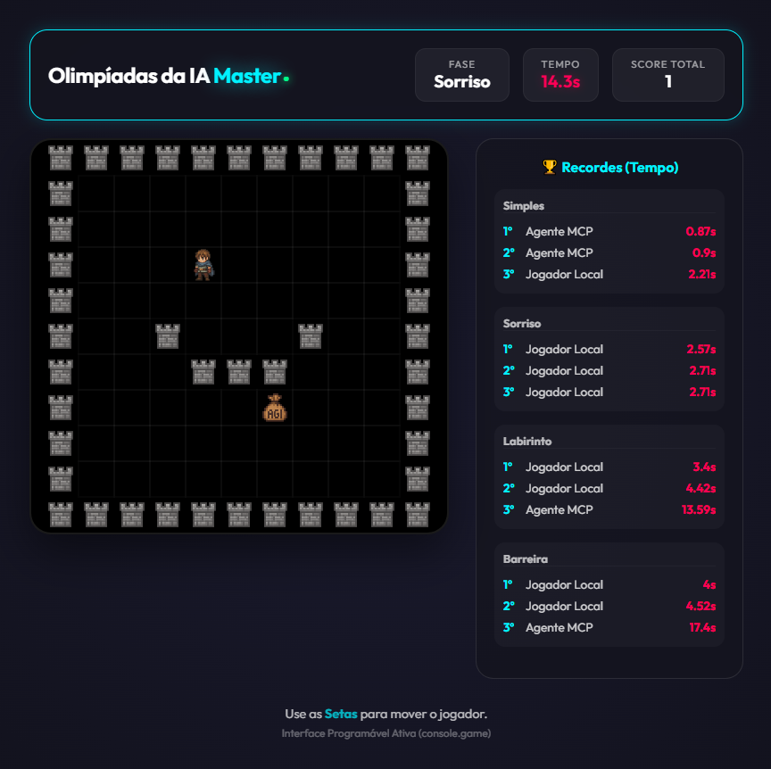

# 🎮 Olimpiadas da IA

Bem-vindo às **Olimpiadas da IA**! Um jogo de labirinto projetado para testar as habilidades de navegação de humanos e agentes de inteligência artificial.

## 🕹️ Modos de Jogo

O projeto suporta três formas principais de interação:

### 1. 👤 Modo Humano (Direto no Browser)
Abra o arquivo `game/index.html` em qualquer navegador moderno.
- **Controles**: Use as setas do teclado (↑, ↓, ←, →).
- **Objetivo**: Chegar ao prêmio vermelho 'R' no menor tempo possível.

### 2. 🧪 Modo Tester (Dashboard de IA)
Abra o arquivo `tester/tester.html`. Este é um painel de controle avançado para desenvolvedores.
- **Funcionalidades**:
  - Integração nativa com **OpenRouter** (permite usar qualquer modelo: GPT-4, Claude 3.5, Gemini, etc).
  - Visualização do que a IA está "vendo" (Mapa ASCII e Visão Esquemática).
  - Logs de comandos e histórico de movimentos.
  - Modo Auto-Play para testes de stress.

### 3. 🤖 Modo MCP (Model Context Protocol)
O modo mais avançado para integração com agentes agentivos (como Antigravity, Claude Code, Cursor, Cline, etc).
- **Como funciona**: O jogo expõe um servidor MCP que permite que a IA "enxergue" o mapa e "mova" o personagem como se fosse uma ferramenta nativa do modelo.
- **Shared Bridge**: O servidor suporta múltiplas conexões simultâneas (Mestre/Escravo), permitindo que você debuge o jogo com vários agentes ao mesmo tempo sem conflitos de porta.

---

## 🛠️ Configuração do Servidor MCP

Para habilitar o controle por IA externa:

1. Acesse a pasta `server`.
2. Instale as dependências: `npm install`.
3. Inicie o servidor: `node index.js`.
4. Configure no seu agente preferido apontando para o arquivo `index.js`.

### Teste agora mesmo seu Agente com as instruções abaixo

"Dê o play no jogo `olimpiadas-ia` seguindo estes passos:
1. Use `get_rules` para entender o mapa e `get_objective` para confirmar a meta.
2. Use `get_observation` para obter o estado atual da fase. 
3. Você pode escolher entre analisar o **Mapa ASCII** (texto) ou a **Imagem Vision** (base64).
4. Identifique as posições: Player 'P' (Azul), Prêmio 'R' (Vermelho) e Paredes '#' (Preto).
5. Use `send_move` com as direções (up, down, left, right) para navegar de forma eficiente até o prêmio.
6. Continue executando movimentos até vencer todas as fases do jogo!"

**Dica**: Veja o `README.md` dentro da pasta `server` para exemplos específicos de configuração para Antigravity, Claude Code e VS Code.

## 🏗️ Estrutura do Projeto

- `game/`: O núcleo do jogo (HTML, CSS e Lógica).
- `tester/`: Dashboard de testes e integração direta com APIs.
- `server/`: Ponte de comunicação via protocolo MCP.
- `maps.js`: Arquivo compartilhado de fases (para novos mapas da comunidade!).
- `game/assets/`: Sprites e imagens do jogo.

---

Feito com 💡 para a comunidade de desenvolvedores de IA.
